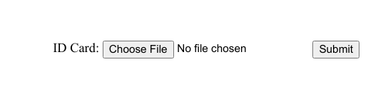
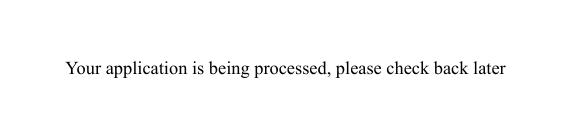
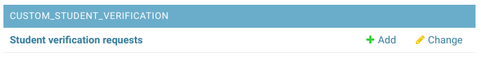
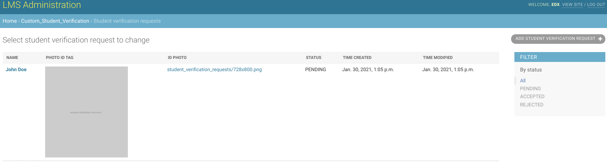
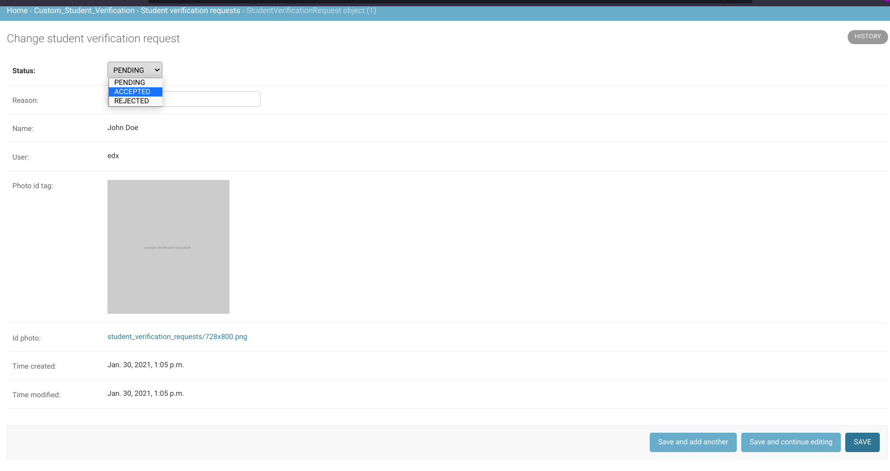

# Using Custom Student Verification App

## Submitting Identification Document

Once installed and enabled, learners should see the following identification document upload form when trying to verify themselves -

Learners should upload their identification documents via this form. After uploading the document they will see a confirmation message -

## Approving Verification Request

Administrators can approve or reject verification requests submitted by learners via LMS Django Admin Panel.

They will see a list of verification requests with status and uploaded document -

Then, they can approve or reject any request from the edit view -

